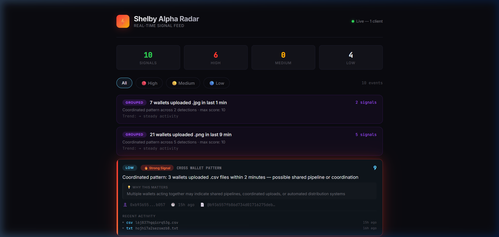

# Shelby Alpha Radar

**Real-time discovery layer for the Shelby network.**

Shelby Alpha Radar continuously indexes blob activity on the Shelby testnet, detects behavioral anomalies across wallets, and surfaces high-signal events through a live feed. It transforms raw on-chain data into actionable intelligence.



---

## Key Features

- **Real-Time Blob Indexing** — Crawls the Shelby testnet, detects `BlobWrittenEvent`, and stores metadata with full RPC retrieval
- **Behavioral Pattern Detection** — Identifies cross-wallet coordination, velocity spikes, first-time bursts, dormant reactivation, and rare file types
- **Alpha Signal Engine** — Scores and prioritizes signals (HIGH / MEDIUM / LOW) with contextual explanations
- **Live SSE Feed** — Server-Sent Events stream pushes signals to connected clients instantly
- **Priority-Based Alerts** — Filter by priority level or watch specific wallets
- **Signal Grouping** — Aggregates related patterns into actionable summaries with trend indicators

## Example Signals

```
🔴 HIGH  [10] "5 wallets uploaded .json files within 2 minutes"
          → Coordinated uploads may indicate shared pipelines

🔴 HIGH  [8]  "Wallet activity surged 5x vs average — 12 uploads in last hour"
          → Velocity spikes may indicate automated scripts

🔵 LOW   [5]  "First-ever .bin file uploaded on Shelby"
          → New file types may represent novel use cases
```

## Architecture

```
Shelby Testnet
     │
     ▼
  Crawler ──→ Queue (Redis) ──→ Worker
                                  │
                              RPC Fetch
                                  │
                                  ▼
                            PostgreSQL
                                  │
                          Alpha Detector
                                  │
                    ┌─────────────┼─────────────┐
                    ▼             ▼             ▼
                REST API      SSE Feed      DB Storage
                    │             │
                    ▼             ▼
               Frontend UI (Live Radar)
```

## Tech Stack

| Component | Technology |
|-----------|-----------|
| API Server | Fastify |
| Database | PostgreSQL + Prisma |
| Queue | Redis + BullMQ |
| Real-Time | Server-Sent Events (SSE) |
| Frontend | Vanilla HTML/CSS/JS |
| Chain | Aptos SDK (Shelby testnet) |

## Run Locally

### Prerequisites

- Node.js 18+
- Docker Desktop (for PostgreSQL + Redis)

### Setup

```bash
# Clone
git clone https://github.com/ysnkhc/shelby-alpha-radar.git
cd shelby-alpha-radar

# Start infrastructure
cd backend
docker compose up -d

# Install dependencies
npm install

# Configure environment
cp .env.example .env
# Edit .env with your settings

# Run database migrations
npx prisma migrate dev --schema=src/database/prisma/schema.prisma

# Start the indexer + API
npx tsx src/index.ts
```

### Open the UI

Open `frontend/index.html` in your browser, or deploy it to Vercel.

The frontend connects to `http://localhost:3000` by default.

## API Endpoints

| Method | Endpoint | Description |
|--------|----------|-------------|
| GET | `/health` | Health check |
| GET | `/blobs/recent` | Latest indexed blobs |
| GET | `/alpha` | All alpha signals |
| GET | `/alpha/high` | High-priority signals only |
| GET | `/alpha/:owner` | Signals for a specific wallet |
| GET | `/stats` | Network statistics |
| GET | `/leaders` | Top wallets by activity |
| GET | `/trends/files` | Trending file types |
| GET | `/owners/:owner` | Wallet profile |
| GET | `/owners/:owner/timeline` | Recent wallet activity |
| GET | `/ws/alpha` | SSE live feed |
| GET | `/ws/alpha?minPriority=HIGH` | Filtered live feed |
| GET | `/ws/alpha?owner=0x...` | Wallet watchlist |

## Deployment

### Backend → Railway

1. New Project → Deploy from GitHub
2. Set root directory: `/backend`
3. Add PostgreSQL + Redis services
4. Set environment variables
5. Start command: `npx tsx src/index.ts`

### Frontend → Vercel

1. Import repo → Set root: `/frontend`
2. Update `API_BASE` in `script.js` with your Railway URL
3. Deploy

---

Built for the Shelby ecosystem.
